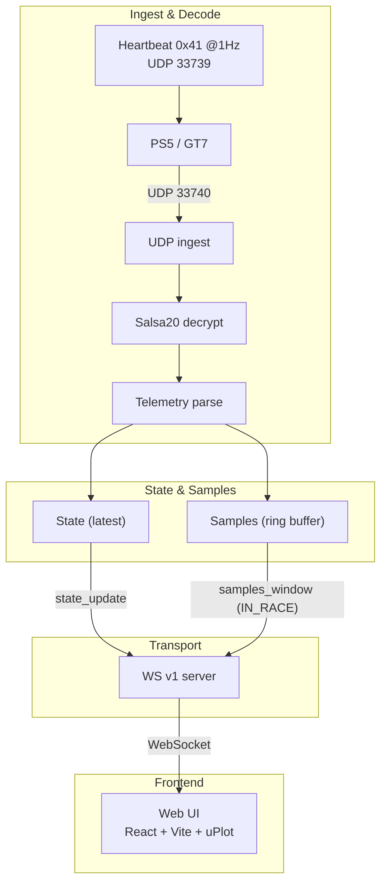

# ApexTelemetry for GT

[](https://www.rust-lang.org/)
[](https://tokio.rs/)
[](https://github.com/tokio-rs/axum)
[](https://vitejs.dev/)
[](https://react.dev/)
[](https://www.typescriptlang.org/)

[English](README.md) | [中文](README.zh-CN.md)

ApexTelemetry for GT is a research-grade telemetry and lap-analysis platform for Gran Turismo 7.

## Tech Stack
- Backend: Rust, tokio, axum, serde, salsa20 (decryption), WebSocket
- Frontend: React, TypeScript, Vite, uPlot

## Architecture


## Requirements
- Rust (stable)
- Node.js + npm

## Layout
- `backend/` Rust server (HTTP + WebSocket)
- `frontend/` React UI (Vite + TypeScript)

## Development
### Backend
```bash
cd backend
cargo run
```

### Frontend
```bash
cd frontend
npm install
npm run dev
```

## GitHub Pages Demo
The repo includes a GitHub Pages demo that runs **entirely in the browser** using a bundled demo telemetry stream decoded via WASM.
- Demo data: `frontend/public/demo/demo_race.bin`
- Demo metadata: `frontend/public/demo/demo_race.meta.json`
- Build mode: `npm run build -- --mode pages` with `VITE_PAGES_DEMO=true` (requires `wasm-pack`)
- Pages URL: `https://Nishikori-Yui.github.io/ApexTelemetry-for-GT/`

## Data Sources
- `data/vendor/GT7Tracks` is sourced from the GT7 track capture tool by the GT7Tracks project (see `data/vendor/GT7Tracks/README.md`).
- Track IDs/names reference the `course.csv` dataset from the `ddm999/gt7info` project as noted in that README.
- Additional discussion of the track capture process is referenced from the GTPlanet forum thread cited in that README.

## Ports and Endpoints
- HTTP/WS: `127.0.0.1:10086`
- Health: `GET /health`
- WebSocket: `GET /ws`
- Debug snapshot: `GET /debug/telemetry`
- Metadata: `GET /meta/current`, `GET /meta/car/{id}`, `GET /meta/track/{id}`
- Track geometry:
  - `GET /meta/track/{id}/geometry` (file presence)
  - `GET /meta/track/{id}/geometry/svg` (normalized SVG path)

## Environment Variables
See `.env.example` for defaults.

## PS5 Connection (Config & Auto-detect)
Backend endpoints (HTTP on `127.0.0.1:10086`):
- `GET /config/udp`
  - Response:
    ```json
    {
      "bind_addr": "127.0.0.1",
      "ps5_ip": null
    }
    ```
- `POST /config/udp`
  - Request:
    ```json
    {
      "bind_addr": "0.0.0.0",
      "ps5_ip": "192.168.1.10"
    }
    ```
  - Response mirrors the stored config.
- `POST /config/udp/auto-detect`
  - Response:
    ```json
    {
      "id": 1,
      "status": "pending",
      "timeout_ms": 10000
    }
    ```
- `POST /config/udp/auto-detect/cancel`
  - Response when active:
    ```json
    {
      "status": "cancelled",
      "id": 1
    }
    ```
  - Response when none:
    ```json
    {
      "status": "no_active_session",
      "id": null
    }
    ```
- `GET /config/udp/auto-detect/{id}`
  - Response:
    ```json
    {
      "id": 1,
      "status": "found",
      "ps5_ip": "192.168.1.10"
    }
    ```

Dev proxy note:
- During frontend dev, `/config/*`, `/debug/*`, and `/meta/*` are proxied to `http://127.0.0.1:10086` by Vite.
 
Semantics:
- Manual `POST /config/udp` with a non-null `ps5_ip` cancels any pending auto-detect and prevents overwrite.
- Auto-detect sessions are single-active; repeated `POST /auto-detect` returns the current session.
- When auto-detect **finds** `ps5_ip` and the current `bind_addr` is loopback, the server auto-switches to `0.0.0.0` to keep LAN UDP reception. User-set non-loopback `bind_addr` is not overridden.

## Heartbeat triggers telemetry
- Heartbeat: UDP `33739`, payload single byte `0x41`, default 1 Hz.
- Telemetry inbound: UDP `33740`.
- Auto-detect uses **broadcast heartbeat** only while status is `pending`.
- When `ps5_ip` is known, heartbeat switches to **unicast** immediately.
- Troubleshooting: if `255.255.255.255` broadcast is ineffective, try your subnet broadcast (e.g. `192.168.50.255`) in network tools.

　## Session & Race State
- `state_update` continues to stream even when not racing (includes `in_race` / `is_paused`).
- `samples_window` is emitted only when the session state is `IN_RACE`.
- Entering `IN_RACE` clears the samples ring buffer so charts start fresh for each race.
- When leaving `IN_RACE`, samples freeze at their last window; no auto-clear.

## Track Geometry (Bring Your Own Data)
Track geometry is loaded from the `GT7Tracks` dumps included in this repo.
- Expected path: `data/vendor/GT7Tracks/dumps/<track_id>.csv`
- The backend exposes `GET /meta/track/{id}/geometry/svg` for a normalized SVG path.
- If the dumps directory is missing, geometry responses return `exists=false`.
- License note: `data/vendor/GT7Tracks` has no explicit license file in this snapshot; please review the upstream README and source before redistribution.

## Debug Telemetry Snapshot
- `GET /debug/telemetry` returns **parsed** fields only (no raw UDP logs).
- Raw encrypted/decrypted hex is exposed only in the HTTP response for local inspection.

## Verification (E2E)
Checklist (repeatable):
- Backend start:
  - Command: `cd backend && cargo run`
  - Expected logs: `starting server` with `127.0.0.1:10086`, and `udp ingest started` with `127.0.0.1:33740`
- Health check:
  - Command: `curl http://127.0.0.1:10086/health`
  - Expected output: `{"status":"ok"}`
- Frontend start:
  - Command: `cd frontend && npm install && npm run dev`
  - Expected UI states: WS status transitions to `open`, gauges render with `--` until telemetry arrives
- WebSocket handshake:
  - Expected UI: `Handshake` shows `hello <server_version>` after connect
- GT7 UDP prerequisites (conservative):
  - PS5/console and PC must be on the same LAN
  - GT7 must be configured to send UDP telemetry to your PC's LAN IP
  - If receiving real packets, set `GT7_UDP_BIND` to your LAN interface (e.g. `0.0.0.0` or the PC LAN IP); default `127.0.0.1` only accepts localhost traffic
  - Confirm UDP port `33740` is open on the PC
- Config + auto-detect verification:
  - `curl http://127.0.0.1:10086/config/udp` returns `ps5_ip: null`
  - `curl -X POST http://127.0.0.1:10086/config/udp/auto-detect` returns `status: pending`
  - Within 10s of GT7 sending packets, `GET /config/udp/auto-detect/{id}` returns `status: found` with `ps5_ip`
  - After detect, `GET /config/udp` shows the detected `ps5_ip`
- Success indicators:
  - State gauges update ~20 Hz (smooth but not max-rate)
  - Chart advances ~4 updates/sec (every 250ms) with 5s window
  - `samples_window` count increases and time span stays around 5s

### E2E Verification Script
Backend + frontend startup:
```bash
cd backend
cargo run
```
```bash
cd frontend
npm install
npm run dev
```

Config endpoints:
```bash
curl http://127.0.0.1:10086/config/udp
```
Expected:
```json
{"bind_addr":"127.0.0.1","ps5_ip":null}
```

Start auto-detect:
```bash
curl -X POST http://127.0.0.1:10086/config/udp/auto-detect
```
Expected:
```json
{"id":1,"status":"pending","timeout_ms":10000}
```

Manual override (cancels pending detect):
```bash
curl -X POST http://127.0.0.1:10086/config/udp \
  -H 'Content-Type: application/json' \
  -d '{"bind_addr":"0.0.0.0","ps5_ip":"192.168.1.10"}'
```
Expected:
```json
{"bind_addr":"0.0.0.0","ps5_ip":"192.168.1.10"}
```

Check detect status:
```bash
curl http://127.0.0.1:10086/config/udp/auto-detect/1
```
Expected (after manual override):
```json
{"id":1,"status":"cancelled","ps5_ip":null}
```

Cancel detect explicitly:
```bash
curl -X POST http://127.0.0.1:10086/config/udp/auto-detect/cancel
```
Expected (if active):
```json
{"status":"cancelled","id":1}
```
Expected (if none):
```json
{"status":"no_active_session","id":null}
```

Expected status transitions:
- `pending -> cancelled` via manual override
- `pending -> cancelled` via cancel endpoint
- `pending -> found` when GT7 telemetry arrives within 10s
- `pending -> timeout` when no telemetry arrives

Heartbeat verification:
- `sudo tcpdump -n -i any udp port 33739` should show outgoing heartbeat `A`
- `sudo tcpdump -n -i any udp port 33740` should show incoming telemetry after heartbeat

### One-shot UDP capture scripts (macOS/Linux/Windows)
These scripts send heartbeats while capturing both UDP ports so you do not need two terminals.

macOS / Linux (bash/zsh):
```bash
chmod +x ./scripts/verify_udp_mac_linux.sh
./scripts/verify_udp_mac_linux.sh 192.168.50.105
```
Or run via bash without chmod:
```bash
bash ./scripts/verify_udp_mac_linux.sh 192.168.50.105
```
Optional env vars:
- `HB_SECONDS=10` (heartbeat duration)
- `CAPTURE_EXTRA=5` (extra capture after heartbeat)
- `TCPDUMP_IFACE=any` (interface, e.g. `en0`)

Windows (run PowerShell as Administrator to allow pktmon capture):
```powershell
.\scripts\verify_udp_windows.ps1 -PS5_IP 192.168.50.105
```
Notes:
- Windows script uses `pktmon` if available; otherwise use Wireshark manually.
- If you do not run PowerShell as Administrator, packet capture will fail; the heartbeat send still works.

### Verification Record (template)
- Date/time:
- Environment notes (OS, Rust/Node versions):
- Backend started (pass/fail):
- Frontend started (pass/fail):
- GET /config/udp (pass/fail):
- POST /config/udp/auto-detect (pass/fail):
- POST /config/udp manual override (pass/fail):
- GET /config/udp/auto-detect/{id} (pass/fail):
- POST /config/udp/auto-detect/cancel (pass/fail):
- Observed transitions:
- Notes:

## GT7 UDP Output
Enable GT7 UDP telemetry output on your console/PS5 and ensure your PC is on the same network.

## Protocol
WebSocket v1 streaming is available for `handshake_hello`, `state_update`, and `samples_window`.

## References
These projects are protocol/UX references only; the implementation here is a clean re-write:
- https://github.com/Bornhall/gt7telemetry
- https://github.com/snipem/gt7dashboard
