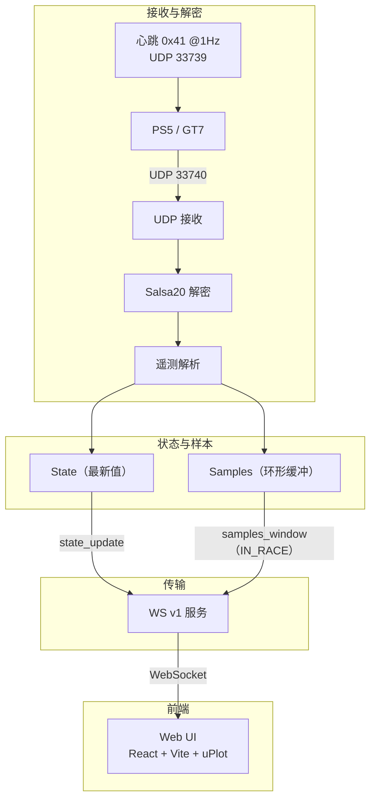

# GT7 LapLab

[](https://www.rust-lang.org/)
[](https://tokio.rs/)
[](https://github.com/tokio-rs/axum)
[](https://vitejs.dev/)
[](https://react.dev/)
[](https://www.typescriptlang.org/)

[English](README.md) | [中文](README.zh-CN.md)

面向 Gran Turismo 7 的研究级遥测与圈速分析平台。

## 技术栈
- 后端：Rust、tokio、axum、serde、salsa20（解密）、WebSocket
- 前端：React、TypeScript、Vite、uPlot

## 架构示意


## 依赖
- Rust（stable）
- Node.js + npm

## 目录结构
- `backend/` Rust 服务（HTTP + WebSocket）
- `frontend/` React UI（Vite + TypeScript）

## 开发
### 后端
```bash
cd backend
cargo run
```

### 前端
```bash
cd frontend
npm install
npm run dev
```

## 端口与接口
- HTTP/WS: `127.0.0.1:10086`
- 健康检查: `GET /health`
- WebSocket: `GET /ws`

## 环境变量
默认值见 `.env.example`。

## PS5 连接（配置与自动检测）
后端接口（HTTP 监听在 `127.0.0.1:10086`）：
- `GET /config/udp`
  - 返回：
    ```json
    {
      "bind_addr": "127.0.0.1",
      "ps5_ip": null
    }
    ```
- `POST /config/udp`
  - 请求：
    ```json
    {
      "bind_addr": "0.0.0.0",
      "ps5_ip": "192.168.1.10"
    }
    ```
  - 响应即为保存后的配置。
- `POST /config/udp/auto-detect`
  - 返回：
    ```json
    {
      "id": 1,
      "status": "pending",
      "timeout_ms": 10000
    }
    ```
- `POST /config/udp/auto-detect/cancel`
  - 存在会话时返回：
    ```json
    {
      "status": "cancelled",
      "id": 1
    }
    ```
  - 无会话时返回：
    ```json
    {
      "status": "no_active_session",
      "id": null
    }
    ```
- `GET /config/udp/auto-detect/{id}`
  - 返回：
    ```json
    {
      "id": 1,
      "status": "found",
      "ps5_ip": "192.168.1.10"
    }
    ```

开发代理说明：
- 前端开发时，`/config/*` 会由 Vite 代理到 `http://127.0.0.1:10086`。
 
语义说明：
- 手动 `POST /config/udp` 且 `ps5_ip` 非空时，会取消正在进行的自动检测并避免被覆盖。
- 自动检测仅允许一个活动会话；重复 `POST /auto-detect` 会返回当前会话。
- 自动检测 **found** 后，如果当前 `bind_addr` 是回环地址，服务端会自动切换为 `0.0.0.0` 以接收局域网 UDP；用户设置的非回环地址不会被覆盖。

## 心跳触发遥测
- 心跳：UDP `33739`，负载单字节 `0x41`，默认 1 Hz。
- 遥测入站：UDP `33740`。
- 自动检测 `pending` 期间使用**广播心跳**。
- 一旦 `ps5_ip` 可用，心跳立即切换为**单播**。
- 排障：如果 `255.255.255.255` 广播无效，可尝试子网广播（如 `192.168.50.255`）。

## 会话与比赛状态
- `state_update` 在非比赛状态也持续输出（包含 `in_race` / `is_paused`）。
- `samples_window` 仅在 `IN_RACE` 时发送。
- 进入 `IN_RACE` 会清空样本环形缓冲，让图表从新比赛开始。
- 离开 `IN_RACE` 后样本窗口冻结，不会自动清空。

## 验证（E2E）
可重复检查清单：
- 启动后端：
  - 命令：`cd backend && cargo run`
  - 期望日志：`starting server` 显示 `127.0.0.1:10086`，以及 `udp ingest started` 显示 `127.0.0.1:33740`
- 健康检查：
  - 命令：`curl http://127.0.0.1:10086/health`
  - 期望输出：`{"status":"ok"}`
- 启动前端：
  - 命令：`cd frontend && npm install && npm run dev`
  - 期望 UI：WS 状态切换到 `open`，未到遥测前仪表显示 `--`
- WebSocket 握手：
  - 期望 UI：`Handshake` 显示 `hello <server_version>`
- GT7 UDP 前置条件（保守）：
  - PS5/主机与 PC 在同一局域网
  - GT7 配置将 UDP 遥测发送到 PC 的局域网 IP
  - 若接收真实数据，设置 `GT7_UDP_BIND` 为 LAN 网卡（如 `0.0.0.0` 或 PC LAN IP）；默认 `127.0.0.1` 只接收本机
  - 确认 PC 上 UDP 端口 `33740` 可用
- 配置 + 自动检测：
  - `curl http://127.0.0.1:10086/config/udp` 返回 `ps5_ip: null`
  - `curl -X POST http://127.0.0.1:10086/config/udp/auto-detect` 返回 `status: pending`
  - 10 秒内有遥测包时，`GET /config/udp/auto-detect/{id}` 返回 `status: found` 和 `ps5_ip`
  - 检测后 `GET /config/udp` 显示已写入 `ps5_ip`
- 成功指标：
  - 状态仪表约 20 Hz 更新
  - 图表约 250ms 更新一次、窗口 5s
  - `samples_window` 数量递增、时间跨度约 5s

### E2E 验证脚本
后端 + 前端启动：
```bash
cd backend
cargo run
```
```bash
cd frontend
npm install
npm run dev
```

配置接口：
```bash
curl http://127.0.0.1:10086/config/udp
```
期望：
```json
{"bind_addr":"127.0.0.1","ps5_ip":null}
```

启动自动检测：
```bash
curl -X POST http://127.0.0.1:10086/config/udp/auto-detect
```
期望：
```json
{"id":1,"status":"pending","timeout_ms":10000}
```

手动覆盖（取消自动检测）：
```bash
curl -X POST http://127.0.0.1:10086/config/udp \
  -H 'Content-Type: application/json' \
  -d '{"bind_addr":"0.0.0.0","ps5_ip":"192.168.1.10"}'
```
期望：
```json
{"bind_addr":"0.0.0.0","ps5_ip":"192.168.1.10"}
```

检测状态查询：
```bash
curl http://127.0.0.1:10086/config/udp/auto-detect/1
```
期望（手动覆盖后）：
```json
{"id":1,"status":"cancelled","ps5_ip":null}
```

显式取消检测：
```bash
curl -X POST http://127.0.0.1:10086/config/udp/auto-detect/cancel
```
期望（存在会话）：
```json
{"status":"cancelled","id":1}
```
期望（无会话）：
```json
{"status":"no_active_session","id":null}
```

期望状态流转：
- `pending -> cancelled`（手动覆盖）
- `pending -> cancelled`（cancel 接口）
- `pending -> found`（10 秒内收到遥测）
- `pending -> timeout`（无遥测）

心跳验证：
- `sudo tcpdump -n -i any udp port 33739` 应看到发出的心跳 `A`
- `sudo tcpdump -n -i any udp port 33740` 应看到心跳后入站遥测

### 一键 UDP 抓包脚本（macOS/Linux/Windows）
脚本会在发送心跳的同时抓取两个端口，避免多终端切换。

macOS / Linux（bash/zsh）：
```bash
chmod +x ./scripts/verify_udp_mac_linux.sh
./scripts/verify_udp_mac_linux.sh 192.168.50.105
```
或直接用 bash：
```bash
bash ./scripts/verify_udp_mac_linux.sh 192.168.50.105
```
可选环境变量：
- `HB_SECONDS=10`（心跳持续时间）
- `CAPTURE_EXTRA=5`（额外抓包时长）
- `TCPDUMP_IFACE=any`（网卡名，如 `en0`）

Windows（PowerShell 需管理员权限以启用 pktmon）：
```powershell
.\scripts\verify_udp_windows.ps1 -PS5_IP 192.168.50.105
```
说明：
- Windows 脚本优先使用 `pktmon`，否则建议用 Wireshark 手动抓包。
- 非管理员权限时抓包会失败，但心跳发送仍可用。

### 验证记录（模板）
- 日期/时间：
- 环境说明（OS、Rust/Node 版本）：
- 后端启动（通过/失败）：
- 前端启动（通过/失败）：
- GET /config/udp（通过/失败）：
- POST /config/udp/auto-detect（通过/失败）：
- POST /config/udp 手动覆盖（通过/失败）：
- GET /config/udp/auto-detect/{id}（通过/失败）：
- POST /config/udp/auto-detect/cancel（通过/失败）：
- 观察到的状态流转：
- 备注：

## GT7 UDP 输出
在主机/PS5 上启用 GT7 UDP 遥测输出，并确保 PC 与其在同一网络。

## Protocol
WebSocket v1 流包含 `handshake_hello`、`state_update`、`samples_window`。

## 参考项目
以下项目仅作为协议与交互参考，当前实现为独立重写：
- https://github.com/Bornhall/gt7telemetry
- https://github.com/snipem/gt7dashboard
